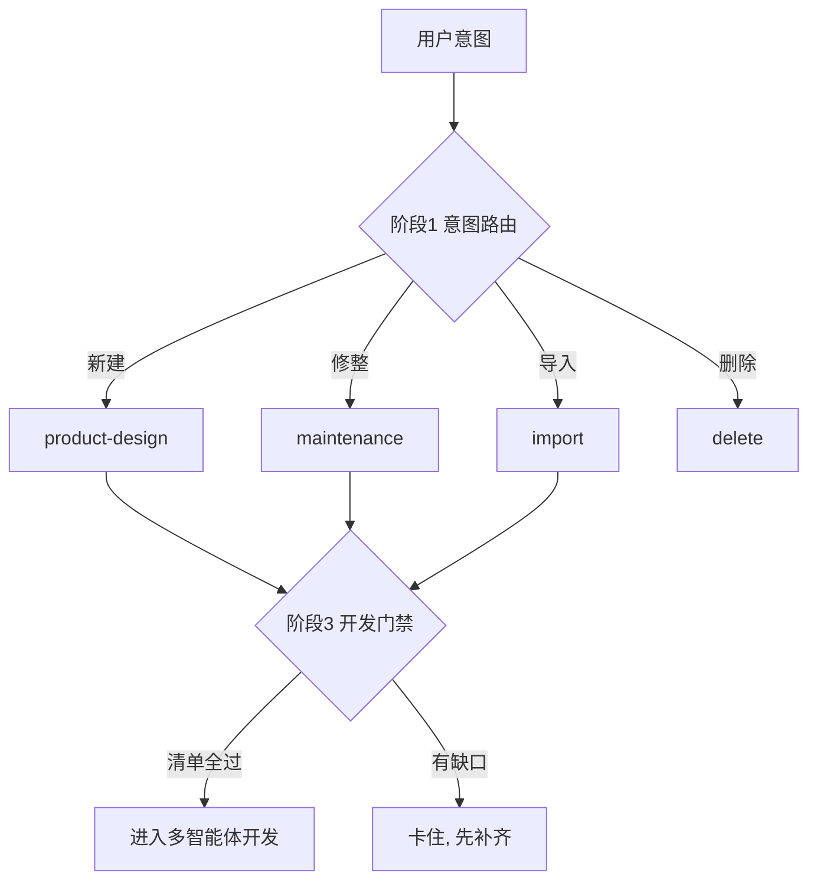

# 范例报告（样板）

> 小石一份合格输出的样板。分析对象：SDD V7.1 Harness（主入口 `harness-core/router.md`）。
> 照这个颗粒度抄：分阶段 + 每阶段分支按「四问」讲清 + 一张脚本渲染的阶段-分支图。

---

# 小石：SDD Harness 阶段-分支图

主入口：`harness-core/router.md`（采集方式：fetch_skill.py）。它干的事：先认人意图，再把任务路由到对应分支，最后才进入开发。

## 阶段拆解

**阶段 1 · 意图路由**
- 有哪些分支？新建项目 / 已有项目修整 / 导入已有代码库 / 删除项目。
- 为什么有这些分支？因为「对一个项目能做的事」就这四类，必须先归类再动手。
- 各解决什么问题？新建＝从零造；修整＝改已有 SDD 项目；导入＝把非 SDD 老代码纳管；删除＝移除。
- 怎么解决？读 `project-registry.json` 定位活动项目，再按用户自然语言匹配到对应 Skill；意图不清就只问一句。

**阶段 2 · 进入对应 Skill**
- 有哪些分支？四条分支各自指向一个 Skill 文件（product-design / maintenance / import / delete）。
- 为什么有？路由本身不展开细节，把判断权交给各 Skill。
- 解决什么？让主入口保持轻、各分支独立演进。
- 怎么解决？Router 只做分发，Skill 内部再判断阶段。

**阶段 3 · 开发门禁**
- 有哪些分支？满足全部门禁 → 进开发；任一不满足 → 卡住。
- 为什么有？防止 PRD/契约/计划没齐就开写。
- 解决什么？保证产物质量、避免跳步。
- 怎么解决？硬清单校验（PRD、api-contracts、Plan、tasks.json、运行时对齐、外部依赖确认、用户确认）。

## 阶段-分支图（脚本渲染）



渲染弹窗：

```bash
python3 scripts/render_mermaid.py --in .sdd/tmp/diagram.mmd --title "小石：SDD Harness 阶段-分支图"
```

> 覆盖说明：基于 router.md；各 Skill 内部子分支未展开。这就是「积木拼大楼」——路由 + 阶段 + 门禁三块标准积木拼出来的。

## 和谁像（结尾必带）
- 最像：**ui-ux-pro-max**——都用了「门禁」积木卡住不合格产物，都靠「真相源 + 多端/多分支适配」。
- 概念映射：SDD 的「开发门禁」≈ ui-ux-pro-max 的「交付前清单」，都是「不达标不放行」；SDD 的「意图路由」≈ ui-ux-pro-max 的「按平台/行业分流」。
- 区别：SDD 路由的是**项目生命周期**（建/改/导/删），ui-ux-pro-max 路由的是**平台能力与行业**；SDD 产物是文档+代码全流程，后者聚焦设计系统。
