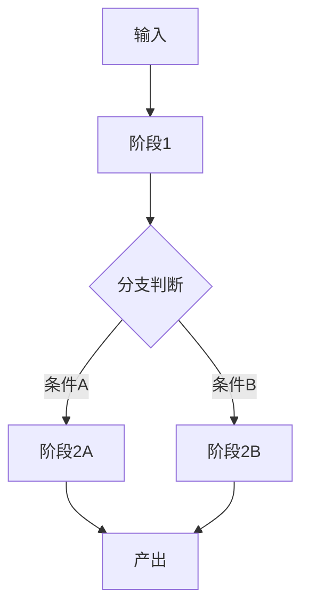

# mermaid 编写规范（避免「Syntax error in text」）

小石画「阶段-分支图」时按这套写，保证能渲染。核心口诀：**标签全引号、不写裸尖括号、边标签也引号**。

## 必守规则

1. **节点标签一律用双引号**：`A["阶段一"]`、判断用 `R{"是否满足"}`。
2. **标签里禁止裸 `<` `>`**（会被当 HTML 标签解析而崩）。占位符改写：
   - ❌ `design-system/<project>/MASTER.md`
   - ✅ `design-system/{project}/MASTER.md` 或 `design-system/[project]/MASTER.md`
   - 唯一例外：换行用的 ` ` 可以保留。
3. **换行只用 ` `**，不要用真实回车，也别用 `\n`。
4. **边标签也用引号**，尤其含 `/ ( ) : ; , 空格`：
   - ❌ `R -->|会改变 looks/feels/moves| A`
   - ✅ `R -->|"会改变 looks/feels/moves"| A`
5. **节点 id 用纯英文/数字**，不带空格和中文（中文放进引号标签里）。
6. **少用易踩雷字符**：标签内尽量避免 `()` `{}` `|` `#` `"`；要用就确保在双引号内，或改成全角 `（）`。
7. **方向声明**：开头固定 `flowchart TD`（上到下）或 `LR`（左到右）。
8. **图别太大**：节点超过 ~25 个就拆成两张（主干图 + 局部放大图），否则又长又容易错。

## 安全骨架（照抄改字）

## 自检（出图前过一遍）

- [ ] 每个节点标签都在 `"..."` 里？
- [ ] 没有裸 `<...>`（除了 ` `）？
- [ ] 每个边标签都在 `|"..."|` 里？
- [ ] 节点 id 全英文数字、无空格？
- [ ] 节点数 ≤ ~25？
